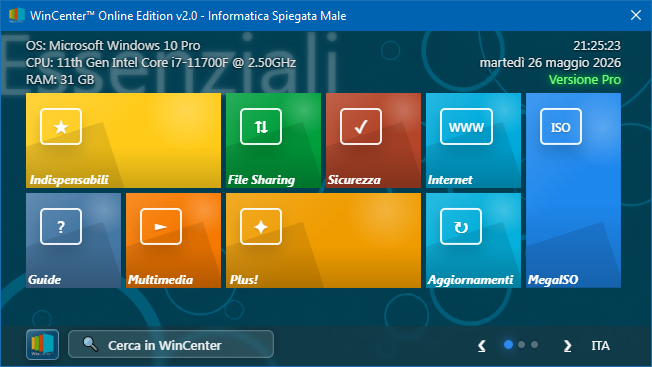
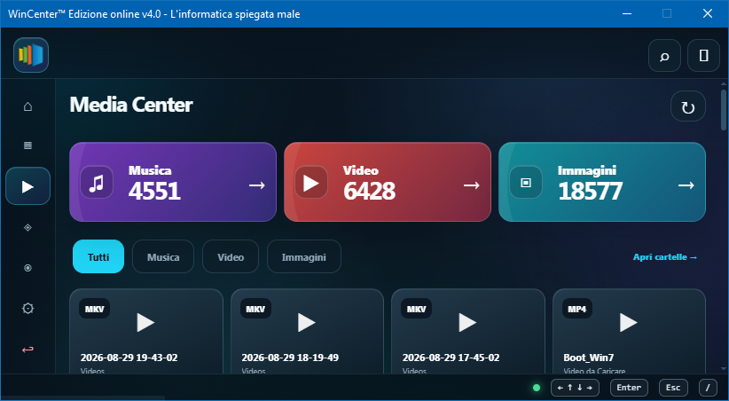

# WinCenter™

### All your Windows tools, in one place.

**WinCenter™** is a Windows utility suite designed to bring together system tools, maintenance, privacy, customization, software management and advanced features inside a single interface.

**Compatible with Windows 7, Windows 10 and Windows 11**

---

## Overview

WinCenter™ is an independent Windows project focused on simplifying operations that are normally spread across different settings, commands and utilities.

Its goal is to offer a cleaner, faster and more practical way to manage Windows, especially for users who want many tools collected in one place.

---

## Main Features

| Area               | Description                                                   |
| ------------------ | ------------------------------------------------------------- |
| **System Tools**   | Windows maintenance, diagnostics and repair tools             |
| **Privacy**        | Privacy Guard and telemetry-related configuration             |
| **Security**       | Firewall, Defender, DNS Guard and related tools               |
| **Drivers**        | Driver information, backup and restore features               |
| **Software**       | Quick access to useful software and utilities                 |
| **Customization**  | Windows customization and interface-related tools             |
| **MegaISO™**       | Advanced Windows ISO creation and customization               |
| **Steam Legacy**   | Experimental tools for Steam compatibility on legacy systems  |
| **WinCenter™ HUB** | Full-screen multimedia and control experience                 |
| **Quick Panel**    | Fast access to important functions from the notification area |

---

## Screenshots

  

> Screenshots may vary depending on the version of WinCenter™.

---

## Downloads

Official versions of **WinCenter™** are available in the **Releases** section of this repository.

### Available Versions

| Version        | Status    | Notes              |
| -------------- | --------- | ------------------ |
| WinCenter™ 1.0 | Archived  | Historical release |
| WinCenter™ 1.2 | Archived  | Historical release |
| WinCenter™ 2.0 | Archived  | Historical release |
| WinCenter™ 2.5 | Archived  | Historical release |
| WinCenter™ 3.0 | Archived  | Historical release |
| WinCenter™ 3.5 | Available | Public release     |
| WinCenter™ 4.0 | Upcoming  | Not yet released   |

> Always download WinCenter™ from official sources only.

---

## Requirements

* Windows 7 SP1 or later
* Windows 10 / Windows 11
* Microsoft Edge WebView2 Runtime
* .NET Framework required by WinCenter™
* Administrator privileges for some functions

Some features may not be available on all Windows versions.

---

## Free and Pro

WinCenter™ includes both **free features** and **advanced features reserved for the Pro version**.

The free version remains usable without requiring the Pro upgrade.

---

## Security and Integrity

Recent versions of WinCenter™ include an internal resource protection and integrity verification system.

If protected files are modified or damaged, WinCenter™ may refuse to start correctly.

For this reason, it is strongly recommended to download the application only from official sources.

---

## Changelog

Each published version includes its own changelog in the related **Release** page.

Release notes may include:

* new features
* visual improvements
* bug fixes
* performance optimizations
* compatibility improvements
* internal security improvements

---

## Source Code

The full source code of WinCenter™ is **not distributed through this repository**.

This repository is intended only for:

* official releases
* changelogs
* public documentation
* screenshots and public project information

---

## Author

**Exile™**
**Informatica Spiegata Male**

WinCenter™ is an independent project focused on Windows users, including those who still care about legacy Windows systems.

---

## Copyright

**WinCenter™ © Exile™**
All rights reserved.

WinCenter™, MegaISO™ and related project names may not be redistributed, modified or used to create derivative products without permission.

---

### WinCenter™

**Windows, managed better.**

